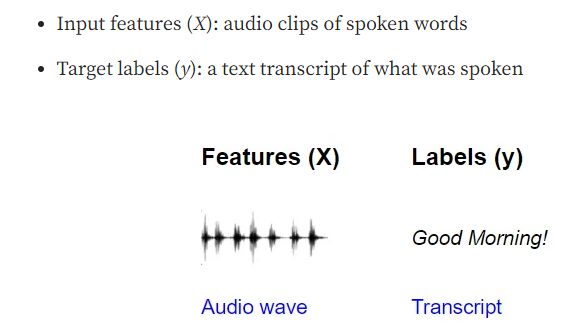
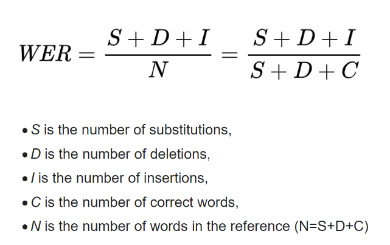

# speech
repo for gripping speech analysis problem

## questions
* How to define a speech analysis problem?
* What are some ML models/ algorithms (SOTA?) for speech analysis?
* What are the basic tools for speech analysis?

## answers
* Speech analysis - the process of extracting meaningful information from speech signals
* Basic tools of speech analysis (in Python) are listed in references
* ML models - how to find them? `ASR` @ huggingface [link](https://huggingface.co/docs/transformers/tasks/asr), 

## problem

## resources
* https://realpython.com/python-speech-recognition/
* https://www.simplilearn.com/tutorials/python-tutorial/speech-recognition-in-python
* https://deepgram.com/learn/best-python-audio-libraries-for-speech-recognition-in-2023
* https://www.youtube.com/watch?v=mYUyaKmvu6Y&ab_channel=freeCodeCamp.org
* https://research.aimultiple.com/speech-recognition-challenges/
* https://towardsdatascience.com/audio-deep-learning-made-simple-automatic-speech-recognition-asr-how-it-works-716cfce4c706
* https://research.facebook.com/publications/machine-learning-paradigms-for-speech-recognition-an-overview/
* https://paperswithcode.com/task/speech-recognition

## data
* VOiCES dataset [link](https://iqtlabs.github.io/voices/)

## tools
* SpeechRecognition
* Librosa
* Deepgram
* lots of APIs like Whisper API, Google Cloud Speech API, IBM Watson Speech to Text API, etc.
* espnet (kinda cool, seems like E2E toolkit)
* wav2vec2

## metrics
* WER - Word Error Rate 

## pipeline
* wav2vec2 -> ... (?)
* (general) waveform -> vectors (?) -> features -> model -> output

