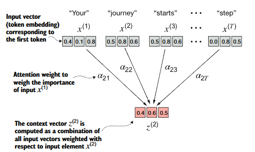
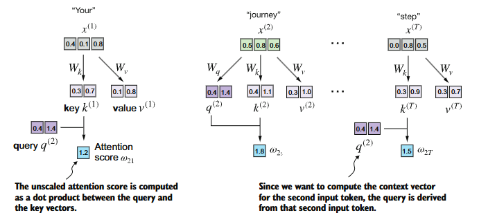

# Attention
... and it's different flavours

## Types of Attention
* simplified self-attention
* `self-attention`
* `causal attention`
* `multi-head attention`

## Motivation
* encoder-decoder to account for different order of input and output sequences
* `context` is important, because it creates enriched representations of each element in an input sequence, by incorporating relevant information from all other elements in the sequence

## Simplified Self-Attention

  

## Self-Attention
* weight parameters vs attention weights
* `W_query`, `W_key`, `W_value` - optimized during training (like *weights query*, etc.)
* `attn_weights` - computed on the fly for each input sequence (like *attention weights*)  

