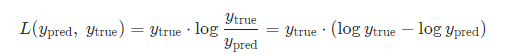
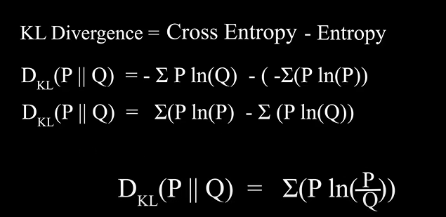

# Kullback-Leibler Divergence
* `D_KL(P || Q)`
* *relative entropy*
* *l-divergence*

## General
* measures how one probability distribution is different from a second, reference probability distribution
* so, in a way, it's similar to [Wasserstein distance](../wasserstein_distance/README.md)
* `D_KL(P || Q) = ∑_x P(x) log(P(x) / Q(x))`
* ... or (witch batchmean)

* not really a distance measure, because it doesn't satisfy the triangle inequality
* `kl divergence = cross entropy - entropy`

* *Jensen-Shannon divergence* is a symmetrized version of the KL divergence
* *entropy is expected value of surprise*

## Resources
* [wikipedia POL](https://pl.wikipedia.org/wiki/Dywergencja_Kullbacka-Leiblera)
* [wikipedia ENG](https://en.wikipedia.org/wiki/Kullback%E2%80%93Leibler_divergence)
* [torch loss docs](https://pytorch.org/docs/stable/generated/torch.nn.KLDivLoss.html)
* [torch functional docs](https://pytorch.org/docs/stable/generated/torch.nn.functional.kl_div.html)
* [pytorch lightning docs](https://lightning.ai/docs/torchmetrics/stable/regression/kl_divergence.html)
* [powerful Indian tutorial](https://www.youtube.com/watch?v=xmvxXXZUXdk&ab_channel=Udacity)
* [another tutorial](https://www.youtube.com/watch?v=WvZ19b6d01A&ab_channel=DevelopersHutt)
* [entropy explained statquest](https://www.youtube.com/watch?v=YtebGVx-Fxw&ab_channel=StatQuestwithJoshStarmer)