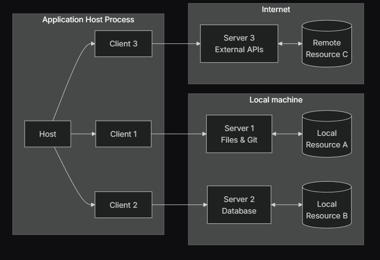

# Model Context Protocol

## General 
* serves as standard way of comunicating LLMs with external world, like data sources and stuff
* introduced by Anthropic as open standard

## Protocol
* uses standard `RPC` under the hood, specifically `JSON-RPC 2.0`, example messages:
  * `Requests`
```protobuf
interface Request {
    method: string; 
}
```
  * `Errors`
```protobuf
interface Error {
    code: number;
    message: string;
    data?: unknown;
}
``` 
* core concepts include: 
  * `Server` -> provide context, tools, prompts, etc. to clients
  * `Client` -> maintain 1:1 conntection with servers, inside the host app
  * `Host` -> LLM application initiating connections

## Architecture


## Design
* servers should be extremely easy to build
* servers should be highly composable
* servers should not be able to read the whole conversation, nor see into other servers
* features can be added to servers and clients progressively

## Security
* need to be careful with MCP security, because servers have quite vast capabilities
* ... so RCEs and similar problems may be present
* `confused deputy problem` 
  * a malicious program may trick other program with higher privileges to abuse it's authority in the system
  * ... so a subclass of *privilege escalation attacks*
  * originaly, it was a compiler which had write permission to certain system directory, which also contained important data, thus by feeding the compiler specific payload (*language to compile*) malicious actor was able to overwrite certain data in system directory

## References
* [intro](https://modelcontextprotocol.io/introduction)
* [specs](https://modelcontextprotocol.io/specification)
* [github repo](https://github.com/modelcontextprotocol/modelcontextprotocol)
* [official github go server](https://github.com/github/github-mcp-server)
* [confused deputy problem](https://en.wikipedia.org/wiki/Confused_deputy_problem)
* [discussion on stateful-vs-stateless MCP](https://github.com/modelcontextprotocol/modelcontextprotocol/discussions/102)
* [pretty cool X/Twitter thread on toy MCP server building](https://x.com/_avichawla/status/1936673005826195841)