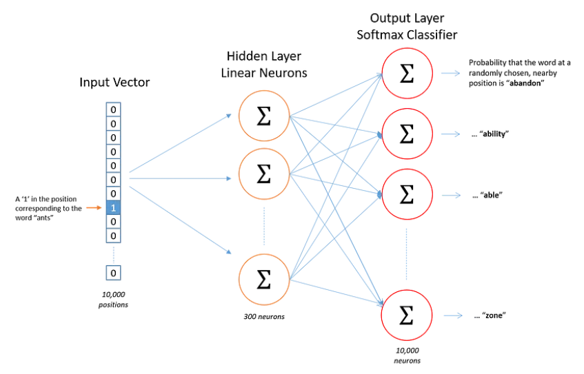

# Word2Vec
* tool to obtain vector representations of words
* estimates word embeddings, based on large corpus
* CBOW (`Continuous Bag of Words`) and skip-gram are two algorithms used to train word2vec models
* developed in Google around 2013
* *Hello World* tool in NLP

## Details
* problem is, the word needs to be in the vocabulary to get embedding
* while this will work for normal cases (because the corpus is large) it's not always the case
* sliding window (pol. *okno przesuwne* or *ramka*) is used to get context words
* words that are used in similar context have similar meaning, therefore should be close in vector space
* `king - man + woman = queen` 
* shallow neural network with one hidden layer
* fixed size vectors

* so:
    - number of neurons in the input layer is the size of the vocabulary
    - number of neurons in the hidden layer is the length of the vector (number of dimensions)
    - number of neurons in the output layer is the size of the vocabulary
* after training weights of the hidden layer are used as word embeddings, so each word has a set of weights that represent it

## Methods
* `CBOW` - predicts the target word based on the context
    - faster
* `skip-gram` - predicts context words based on the target word
    - oposite of CBOW
    - slower

## Limitations
* difficulty with handling out-of-vocab words
* doesn't share representations at sub-word level
* difficult to scale (for each new lang new embedding matrix is needed)

## Applications
* gensim can be used to train new word embeddings
* visualization often requires PCA or similar technique

## References
* [medium post](https://medium.com/@manansuri/a-dummys-guide-to-word2vec-456444f3c673)
* [wikipedia](https://en.m.wikipedia.org/wiki/Word2vec)
* [some blog in PL](https://clarin-pl.eu/index.php/word2vec/)
* [cooler blog in PL](https://edrone.me/pl/blog/word2vec-w-pigulce)
* [cool notebook (partially) about word2vec](https://github.com/KNSI-Golem/BootcampGeneral/blob/main/2021/meetings/meeting_10_NLP/notebook.ipynb)
* [blogpost in EN](https://serokell.io/blog/word2vec)
* [demo notebook on Covid-19 tweets dataset](https://colab.research.google.com/drive/1YkSrvfWR_EBFFrhV5E15Z6k5es4Kluom?usp=sharing)